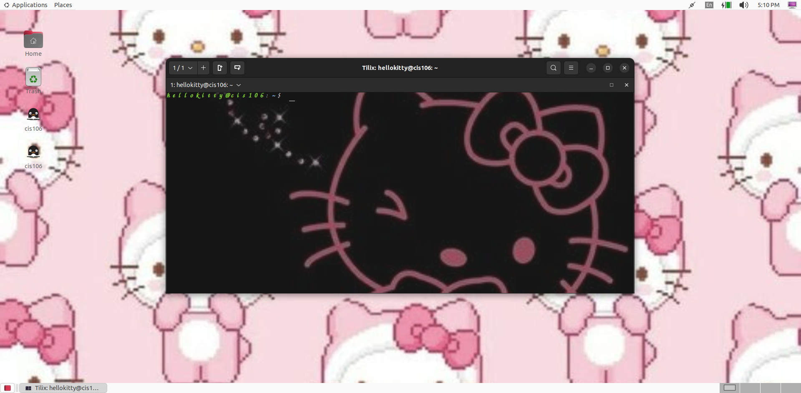

# Lab 3 Submission

## Question 1

## Question 2

## Question 3 
| Program purpose     | Package Name      | Version            |
| ------------------- | ----------------- | ------------------ |
| Play a tetris game  | blockattack       | 2.7.0.1            |
| Play a video file   | dragonplayer      | 4:21.12.3-Oubuntu1 |
| Browse the internet | piphany-browser   | 42.4-Oubuntu1      |
| Read your email     | plasma-gmailfeed  | 1.1-2              |
| Play music          | mopidy-soundcloud | 3.0.1-1            |

## Question 4
| command | what it does                                                   |
| ------- | -------------------------------------------------------------- |
| echo    | display a line of text                                         |
| fortune | print a random, hopefully interesting, adage                   |
| cowsay  | configurable speaking/thinking cow and a bit more              |
| lolcat  | rainbow coloring effect for text console display               |
| figlet  | display large characters made up of ordinary screen characters |
| toilet  | display large colourful characters                             |
| rig     | Random Identity Generator                                      |
