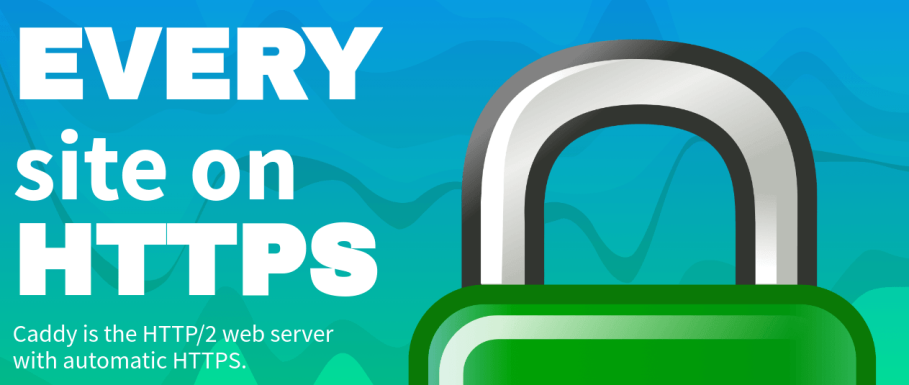

# Deliverable 1

## Concepts I don't understand
- dynamically loadable modules
- UFW firewall

## What is a web server? Hardware and software side
- A web server on the software side is a computer system capable of delivering web content to end users over the internet via a web browser. It contains an Operating System, web server software, database software, application software, security software, configuration files, and finally logging and monitoring tools. On the hardware side it is a computer that stores the web server software and a website’s component files, the processor which handles computation and processing, the RAM which stores data, storage for storing data, content, etc, network interface and the redundancy and back up systems.
  
## What are some different web server applications?
-	Some different web server applications are:
### Apache

- Powers the majority of websites in the world.
- Available on all platforms- Linux, Windows, MacOS, and more.
- Tons of functionality offered through a large collection of modules.

### Nginx

- Nginx was released as a project in 2002 by a Russian engineer who got fed up with then-present solutions' inability to beat the ck10 problem (basically, handling thousands of concurrent connections).
- Best-in-the-class static file handling, load balancing, and reverse proxy capabilities. 

### LiteSpeed Web Server

- OpenLiteSpeed is the open source flavor of enterprise web server offered by LiteSpeed Technologies.
-  Compatible with Apache's mod_rewrite, which means if you have a ton of existing Apache files, migrating will be minimal pain. 
  
### Caddy

- One of the hottest new framework making splashes in the open-source community recent is Caddy. 
- Think of Caddy as an Nginx-like web server (similar syntax and all) but everything is simplified to a pleasant extreme.  
- HTTPS enabled by default. Yes, you don't need to do anything for installing or renewing SSL certificates.

## What is virtualization?
- Virtualization is a technology that allows multiple virtual environments to run on a physical computer or a server. 
  
##	What is virtualbox?
-	Virtualbox is an open-source software that lets its users create and manage virtual machines on their personal computers. 

### What is a virtual machine?
- A virtual machine is a software-based emulation of a physical computer that runs on a host system like Virtualbox.

## What is Ubuntu Server?
-	Ubuntu server is a variant of Ubuntu operating system that is designed for use as a server.
## What is a firewall?
-	A firewall is a network security device or software that acts as a barrier or filter between a trusted network and an untrusted network. 	Firewalls are a fundamental component of network security and serve several important functions.
## What is SSH?
-	SSH stands for Secure Shell which is a cryptographic network protocol and a secure method for remotely accessing and managing devises over a potentially unsecured network. 
