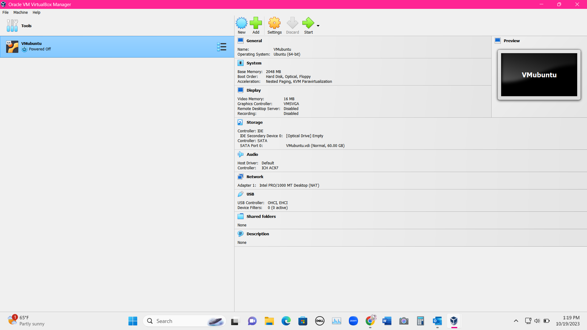

# Deliverable 2

1.	What are the server hardware specifications (virtual machine settings)? Take a screenshot - don’t type it!

2.	What is Ubuntu server log in screen? Take screenshot - do not type it!

3.	What is the IP address of your Ubuntu Server Virtual Machine?

4.	How do you enable the Ubuntu Firewall?
-	TYPE IN COMMAND: $ sudo ufw enable

5.	How do you check if the Ubuntu Firewall is running?
-	TYPE IN COMMAND: $ sudo systemctl status ufw 

6.	How do you disable the Ubuntu Firewall?
-	$ sudo ufw disable

7.	How do you add Apache to the Firewall?
-	$ sudo apt allow

8.	What is the command you used to install Apache?
-	$sudo apt install apache2 -y

9.	What is the command you use to check if Apache is running?
-	$ systemctl status apache2 --no-pager

10.	What is the command you use to stop Apache?
-	$ sudo systemctl stop apache2

11.	What is the command you use to restart Apache?
-	$ sudo systemctl restart apache2 

12.	What is the command used to test Apache configuration?
- apachectl 

13.	What is the command used to check the installed version of Apache?
- $ apache2 -v

14. What are the most common commands to troubleshoot Apache errors? Provide a brief description of each command.
* systemctl- used to control and interact with Linux services via the systemd service manager
* journalctl- used to query and view the logs that are generated by systemd
* apachectl- when troubleshooting, this command is used to check Apache's configuration

