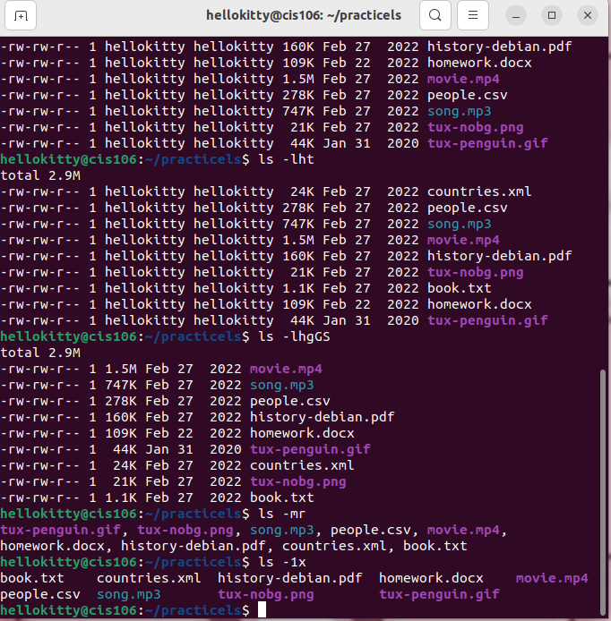

# Week Report 4

## Practice from the presentation The Linux File system:
### Practice 1
 

### Practice 2
 

### Practice 3
 

## The Linux File system directories and their purpose:

 
 
 

## All the commands for navigating the filesystem

| Command | What it does                                               | Syntax                                | Example        |
| ------- | ---------------------------------------------------------- | ------------------------------------- | -------------- |
| pwd     | used for displaying the current working directory          | `pwd`                                 | `pwd`          |
| cd      | used for changing the current working directory            | `cd` + `destination`                  | `cd downloads` |
| ls      | used for displaying all the files inside a given directory | `ls' + 'option` + `directory to list` | `ls -a`        |

## Basic terminology
* **File system**
* The way files are stored and organized.
  
* **Current directory**
* The directory where you are at the moment.
  
* **parent directory**
* You are always working inside a particular directory and you can move forward to a subdirectory or backwards to the previous directory

* **the difference between your home directory and the home directory**
*When you open your terminal emulator, your current working directory is your home directory.when you open file manager, your current working directory is the home directory.

* **pathname**
*  In a filesystem, every file has a pathname which indicates the location fo the file int he filesystem (like an address)
  
* **absolute path**
* the location of a file starting at the root of the file system.
  
* **relative path**
* the location of a file starting from the current working directory or a directory that is located inside the current working directory.