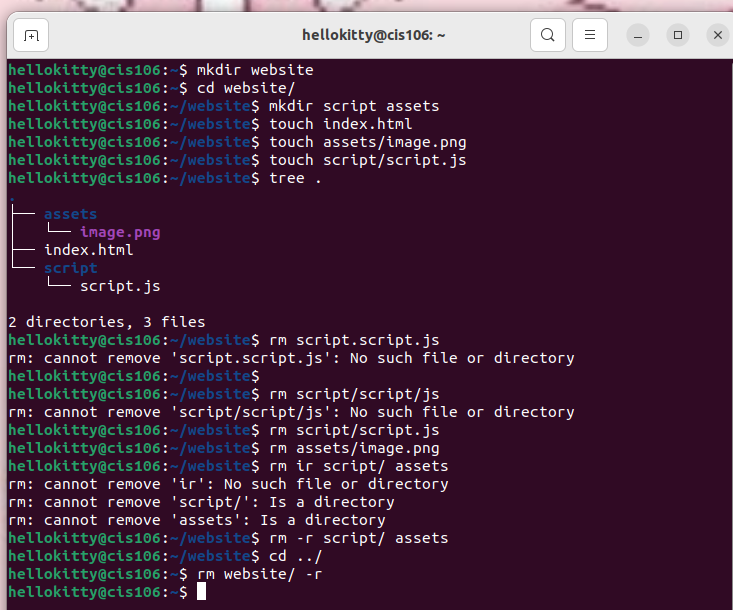
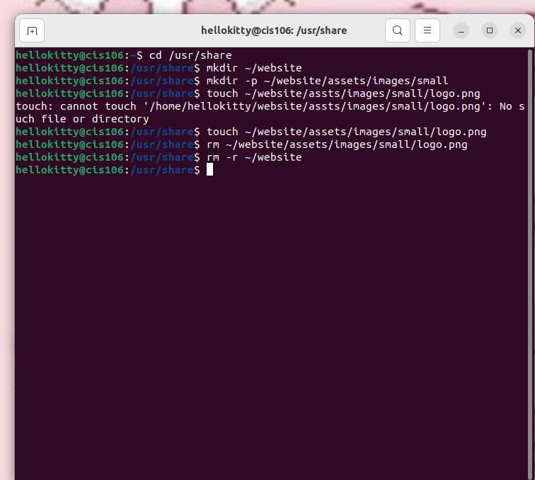
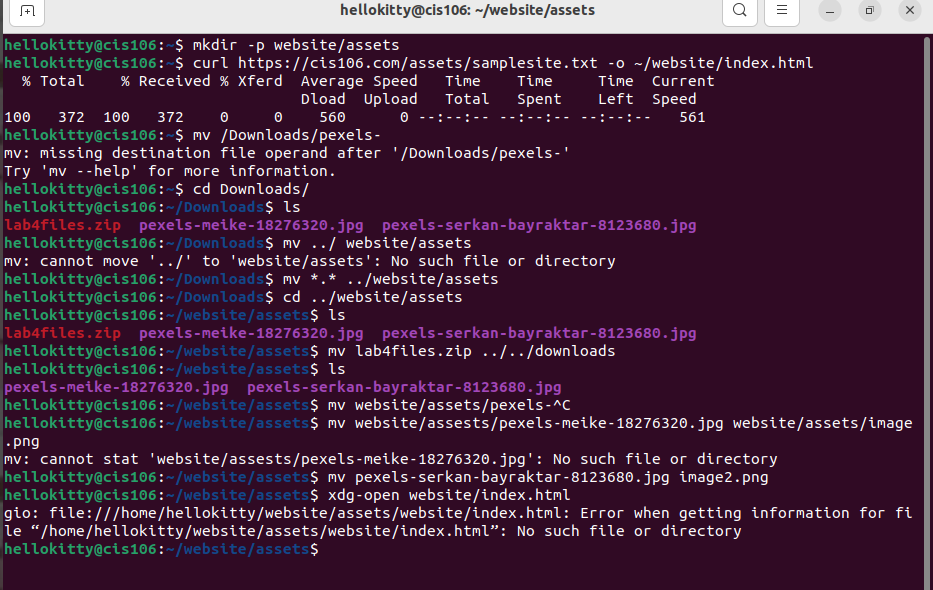
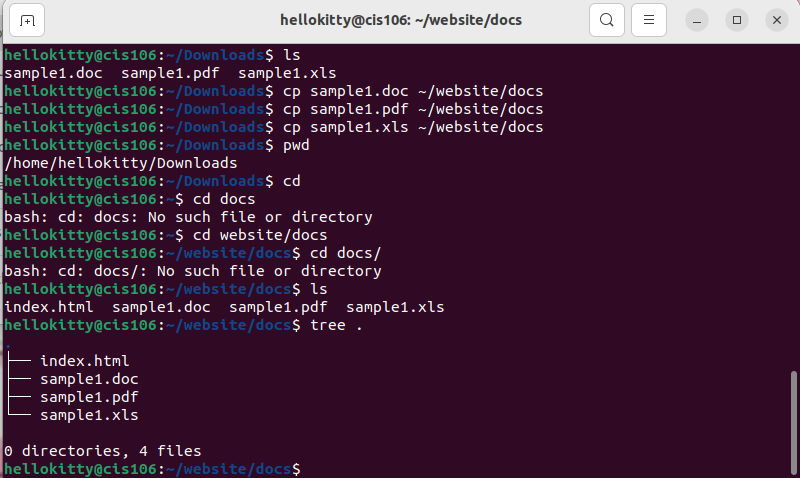

# Week Report 3

## Answer to questions:

* **What are Command Options?**
    Modifies the operation of a command.

* **What are Command Arguments?**
    Arguments that are indicated after the name of a program in the framework's order line.

 * **Which command is used for creating directories? Provide at least 3 examples.**
    - mkdir mice
    - mkdir mice/animals
    - mkdir ~/mice/zoo
  
* **What does the touch command do? Provide at least 3 examples.**
    Touch is used for creating files.
    - touch list
    - touch list_of_cars.txt script.py names.csv
  
* **How do you remove a file? Provide an example.**
    rm removes files
  -  rm list

* **How do you remove a directory and can you remove non-empty directories in Linux? Provide an example**
 you remove a directory by using: "rm -r"
 you remove non empty directory by using: "rm -r Downloads/games"

* **Explain the mv and cp command. Provide at least 2 examples of each.**
  
    *mv command moves and renames directories:*
   - mv + source + destination

    renaming files/directories:
   - mv + file/directory to rename + new name

    cp copes files/directories from a source to a destination

    - cp + files to copy + destination
  - cp Downloads/wallpapers.zip Pictures/

## Practice 1
 

## Practice 2
 

## Practice 3
 

## Practice 4
 

