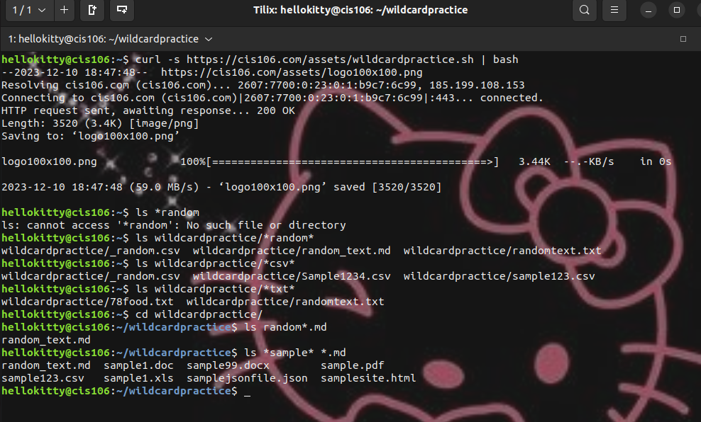
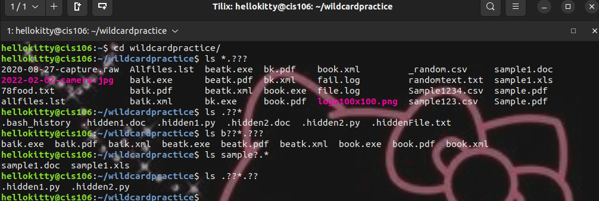
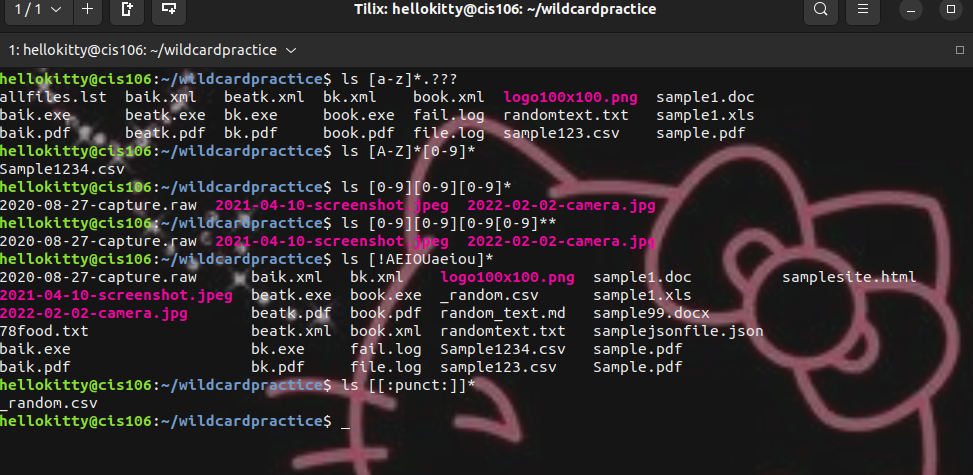

# Week Report 6

## Wildcards.

### * Wildcard
the * wildcard matches from 0 to any number of characters.
* Examples:
    * List all the text file in a directory
      * 'ls *.txt'
    * List all the files that start with the word file
      * 'ls file*'
    * Copy all the mp4 files
      * 'cp Downloads/*.mp4 ~/Videos/Movies/'

## ? Wildcard
The ? wildcard matches a single character 
* Examples:
    * to list all hidden files
      * 'ls .??*'
    * to list all the files that have 3 characters and are followed by the word file in the same name 
      * 'ls ???File*
    * to list all files that start with letter b
      * 'ls b??*'

## [] Wildcard
The brackets wildcard match a single character in a range, uses the exclamation mark to reverse the match
  * Examples:
    * to match all files that have a vowel after letter f 
      * 'ls f[aeiou]*'
    * to match all files that do not have a vowel after letter f
      * 'ls f[!aeiou]'
    * to match all files that have a range of letters after f
      * 'ls f[a-z]*'

## Brace expansion
The brace expansion {} is not a wildcard but another feature of bash that allows you to generate arbitrary strings to use with commands.
* Examples:
  * to create a whole directory structure ina  single command
    * 'mkdir -p music/{jazz,rock}/{mp3files,videos,oggfiles}/new{1..3}
  * to create a N number of files use
    * touch website{1..5}.html
  * remove multiple file in a single directory
    * rm -r {dir1,dir2,dir3,file.txt,file.py}

## Practice

# Practice 5
 

# Practice 6
 

# Practice 7
 
